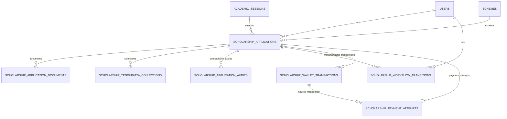

# Application Workflow Database Design

## 1. Old Schema

The inherited application table stored workflow and payment meaning in overlapping columns:

- `scholarship_applications.status`: numeric production workflow status.
- `scholarship_applications.payment_status`: beneficiary payment status.
- `scholarship_applications.wallet_paid_at`: VLE submission wallet completion timestamp.
- `scholarship_wallet_transactions.status`: CSC wallet transaction status.
- `scholarship_application_audits.from_status` / `to_status`: numeric workflow history.

Legacy source data also used `payment_txn_status`, where `1` meant the VLE wallet payment had succeeded. If it was not `1`, the application stayed at workflow status `0`, meaning Pending at VLE.

## 2. Problems In Legacy Design

- Wallet submission payment, beneficiary payment, application submission, and approval workflow were mixed.
- `status = 0` could mean draft, wallet pending, or entered workflow depending on `payment_txn_status`.
- Administrative queues could not clearly distinguish unpaid VLE applications from submitted workflow applications.
- History stored numeric status movement but not independent application/payment/approval state transitions.
- Reporting had to infer lifecycle from multiple fields instead of querying explicit business states.

## 3. New Schema

`scholarship_applications` now separates lifecycle concepts:

- `application_state`: `created`, `in_workflow`, `returned_for_correction`, `rejected`, `completed`.
- `submission_state`: `draft`, `wallet_pending`, `submitted`, `resubmitted`.
- `workflow_state`: named workflow queue/status such as `pending_samiti`, `pending_ic`, `pending_hq`, `pending_accounts`, `payment_completed`.
- `workflow_stage`: owning workflow level: `vle`, `samiti`, `ic`, `district_union`, `hq`, `accounts`, `completed`, `closed`.
- `approval_state`: `pending`, `recommended`, `returned_for_correction`, `rejected`, `approved`.
- `payment_state`: wallet and beneficiary payment state, for example `wallet_pending`, `wallet_success`, `beneficiary_payment_submitted`, `beneficiary_payment_success`.
- `entered_workflow_at`, `returned_at`, `rejected_at`, `completed_at`: lifecycle timestamps.

New tables:

- `scholarship_workflow_transitions`: normalized transition history across application, workflow, payment, and approval states.
- `scholarship_payment_attempts`: normalized payment attempts for VLE wallet submission fee and future payment channels.

Existing compatibility columns remain during migration:

- `status`, `status_label`, `current_stage`, `is_draft`, `wallet_paid_at`, `payment_status`, `paid_at`.

They are now mirrors for existing screens/tests and not the long-term domain model.

## 4. ER Diagram

## 5. Relationship Explanation

- `ScholarshipApplication` belongs to the VLE applicant, scheme, academic session, and geography masters.
- `ScholarshipApplication` has many `ScholarshipWorkflowTransition` records.
- `ScholarshipApplication` has many `ScholarshipPaymentAttempt` records.
- `ScholarshipPaymentAttempt` may reference a `ScholarshipWalletTransaction`.
- Existing document, collection, notification, batch, wallet, and audit relationships are preserved.

## 6. Workflow Explanation

The lifecycle is now explicit:

1. Application created by VLE:
   - `application_state = created`
   - `submission_state = draft`
   - `workflow_state = pending_at_vle`
   - `workflow_stage = vle`
   - `payment_state = wallet_not_started`
2. VLE initiates wallet:
   - `submission_state = wallet_pending`
   - `payment_state = wallet_pending`
3. Wallet succeeds:
   - `payment_state = wallet_success`
4. Application enters workflow:
   - `application_state = in_workflow`
   - `submission_state = submitted`
   - `workflow_state = pending_samiti`
   - `workflow_stage = samiti`
   - `entered_workflow_at` set.
5. Workflow transitions move through:
   - Samiti
   - IC
   - District Union
   - HQ
   - Accounts
6. Final beneficiary payment:
   - success: `application_state = completed`, `payment_state = beneficiary_payment_success`.
   - failure: `payment_state = beneficiary_payment_failed`, workflow remains actionable.

## 7. Payment Lifecycle

VLE wallet submission fee:

- Stored in `scholarship_wallet_transactions`.
- Mirrored in `scholarship_payment_attempts` as `payment_purpose = vle_submission_fee`.
- Tracks transaction number, amount, payment state, requested/completed timestamps, failure reason, attempt number, request payload, and response payload.

Beneficiary payment:

- Represented by `payment_state` on the application.
- Existing `payment_status`, `payment_reference_id`, `payment_failure_reason`, and `paid_at` remain for current screens.
- Future bank/UTR payment records should be added as additional `scholarship_payment_attempts` with a separate `payment_purpose`.

## 8. Visibility Rules

- VLE sees only own applications, including `created` and `wallet_pending`.
- Non-VLE roles only see applications where `application_state` is one of:
  - `in_workflow`
  - `returned_for_correction`
  - `rejected`
  - `completed`
- Created/wallet-pending applications do not appear in admin listing, workflow queues, dashboard counts, or reports.
- Accounts visibility is based on `workflow_stage = accounts`.

## 9. Migration Strategy

- Add normalized columns to `scholarship_applications`.
- Add `scholarship_workflow_transitions`.
- Add `scholarship_payment_attempts`.
- Backfill normalized states from existing production status/payment fields.
- Keep old integer status columns as compatibility mirrors while screens and exports are migrated.
- Write both legacy compatibility fields and normalized fields in the service layer.

## 10. Tables Modified

- `scholarship_applications`
  - Added application, submission, workflow, approval, payment state columns.
  - Added lifecycle timestamps.

## 11. Tables Added

- `scholarship_workflow_transitions`
- `scholarship_payment_attempts`

## 12. Business Rule Mapping

| Business Rule | New Representation |
| --- | --- |
| Wallet not successful means not in workflow | `application_state = created`, `submission_state = wallet_pending`, `payment_state = wallet_pending` |
| Wallet success enters workflow | `payment_state = wallet_success`, then `application_state = in_workflow`, `workflow_state = pending_samiti` |
| Pending at VLE | `workflow_state = pending_at_vle`, `workflow_stage = vle` |
| Samiti queue | `workflow_state = pending_samiti`, `workflow_stage = samiti` |
| IC queue | `workflow_state = pending_ic`, `workflow_stage = ic` |
| District Union queue | `workflow_state = pending_district_union`, `workflow_stage = district_union` |
| HQ queue | `workflow_state = pending_hq`, `workflow_stage = hq` |
| Accounts queue | `workflow_stage = accounts` |
| Returned | `application_state = returned_for_correction`, `approval_state = returned_for_correction` |
| Rejected | `application_state = rejected`, `approval_state = rejected` |
| Payment completed | `application_state = completed`, `approval_state = approved`, `payment_state = beneficiary_payment_success` |

## Verification

- `php artisan migrate`
- `./vendor/bin/pint --dirty`
- `php artisan test`
