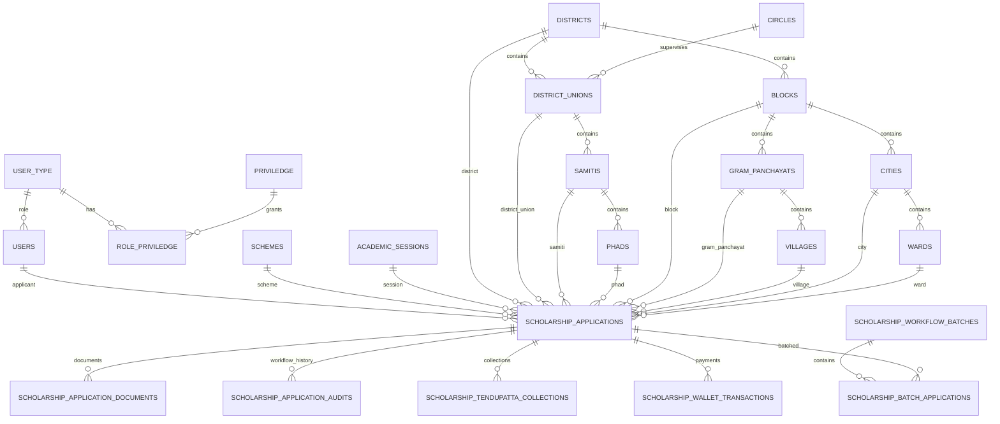

# Entity Relationship Diagram

## Scholarship Core

## Legacy Preservation

Legacy identifiers are preserved in dedicated columns:

- `districts.legacy_code`
- `district_unions.legacy_id`
- `district_unions.legacy_district_code`
- `district_unions.legacy_circle_id`
- `samitis.legacy_id`
- `samitis.legacy_district_union_id`
- `phads.legacy_id`
- `phads.legacy_code`
- `blocks.legacy_code`
- `gram_panchayats.legacy_code`
- `villages.legacy_code`
- `cities.legacy_code`
- `wards.legacy_code`
- `scholarship_applications.legacy_application_id`

`source_data_archives` remains an audit/migration trace, not the business relationship model.
